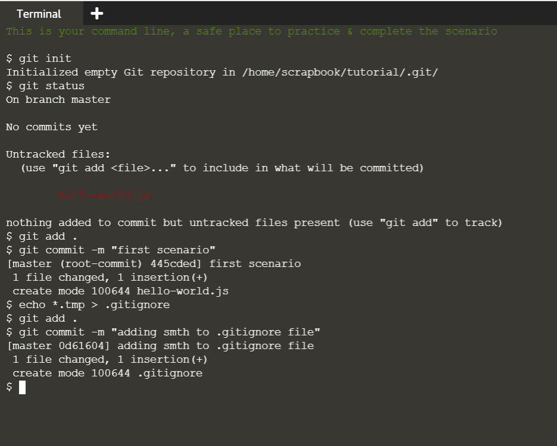
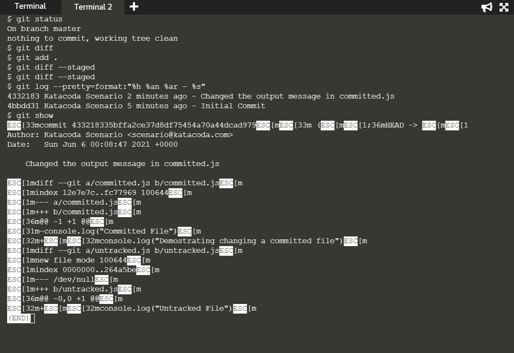
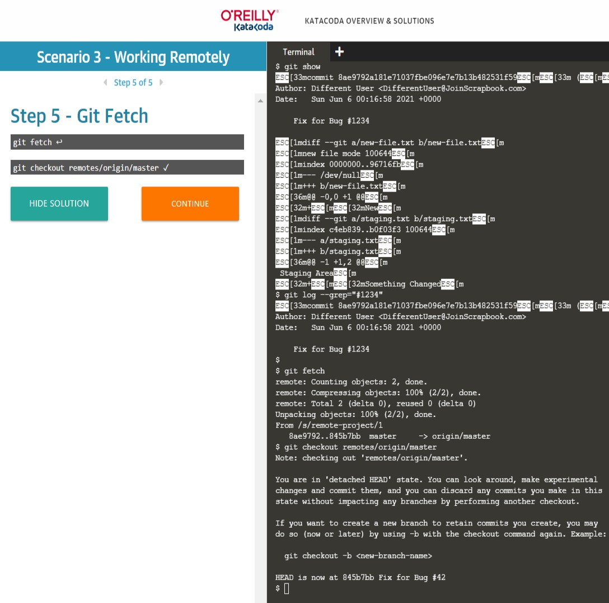
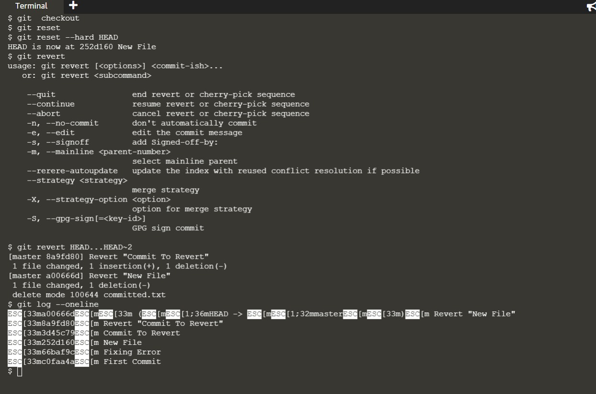
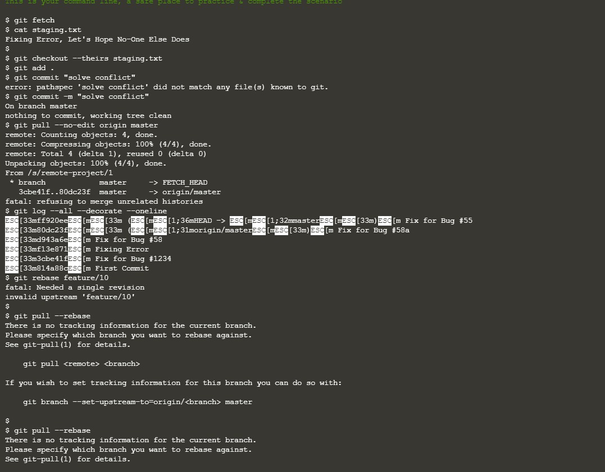
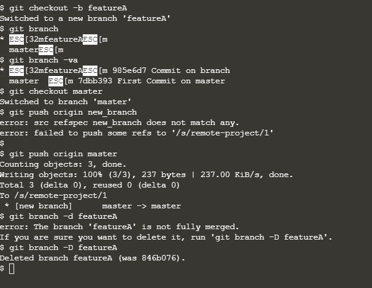

### Learn Git Version Control using Interactive Browser-Based Scenarios.
- ###   ***this a Writeup for Lab10c***.
### First Scenario:
  - In this scenario you'll learn how to initialise a new Git repository and commit files into version control.
      
      
### Second Scenario:

- Learn how to compare and commit changes.
- The command git diff enables you to compare changes in the working directory against a previously committed version.
      

### Third Scenario:
- In this scenario you'll learn how you can share the changes in your repository with other people and combine their changes into your repository. 
      

### Fourth Scenario:

- One of the main advantages when using a version control system is the ability to undo changes and return to a previous version.  
      

### Fifth Scenario:
- In this scenario you will learn how you can share the changes in your repository with other people and combine their changes in your own repository.
      

### Sixth Scenario:
- In this scenario you will learn how you can create branches in your repository. A branch allows you to work, in effectively, a brand new working directory. The result is that a single Git repository can have multiple different versions of the code-base, each of which can be swapped between without changing directories.
      
