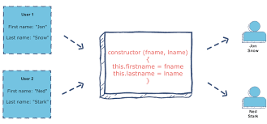

# HTML tables
- allow web developers to arrange data into rows and columns.

### Define an HTML Table
The <table> tag defines an HTML table.

Each table row is defined with a <tr> tag. Each table header is defined with a <th> tag. Each table data/cell is defined with a <td> tag.

By default, the text in <th> elements are bold and centered.

By default, the text in <td> elements are regular and left-aligned.

### HTML Table - Add a Border
* To add a border to a table, use the CSS border property

### TML Table - Collapsed Borders
To let the borders collapse into one border, add the CSS border-collapse property.

### HTML Table - Add Cell Padding
Cell padding specifies the space between the cell content and its borders.

If you do not specify a padding, the table cells will be displayed without padding.

To set the padding, use the CSS padding property.

# Constructors

- Object Types (Blueprints) (Classes)
The examples from the previous chapters are limited. They only create single objects.

- Sometimes we need a "blueprint" for creating many objects of the same "type".

- The way to create an "object type", is to use an object constructor function.
- Objects of the same type are created by calling the constructor function with the new keyword

### The this Keyword
In JavaScript, the thing called this is the object that "owns" the code.

The value of this, when used in an object, is the object itself.

In a constructor function this does not have a value. It is a substitute for the new object. The value of this will become the new object when a new object is created.

Note that this is not a variable. It is a keyword. You cannot change the value of this.

### String Objects
Normally, strings are created as primitives: var firstName = "John"

But strings can also be created as objects using the new keyword: var firstName = new String("John")

Learn why strings should not be created as object in the chapter JS Strings.

### Number Objects
Normally, numbers are created as primitives: var x = 123

But numbers can also be created as objects using the new keyword: var x = new Number(123)

Learn why numbers should not be created as object in the chapter JS Numbers.

### Boolean Objects
Normally, booleans are created as primitives: var x = false

But booleans can also be created as objects using the new keyword: var x = new Boolean(false)

Learn why booleans should not be created as object in the chapter JS Booleans.

