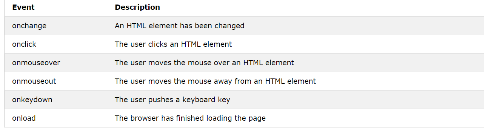

## Forms and JS Events
### Forms in HTML
#### An HTML form is used to collect user input. The user input is most often sent to a server for processing.

##### The <form> Element
- The HTML <form> element is used to create an HTML form for user input.

- The <form> element is a container for different types of input elements, such as: text fields, checkboxes, radio buttons, submit buttons, etc.

 - All the different form elements are covered in this chapter: HTML Form Elements.

* The <input> Element
The HTML <input> element is the most used form element.

- An <input> element can be displayed in many ways, depending on the type attribute.

#### Text Fields
The <input type="text"> defines a single-line input field for text input.
#### The <label> Element
Notice the use of the <label> element in the example above.

The <label> tag defines a label for many form elements.

The <label> element is useful for screen-reader users, because the screen-reader will read out loud the label when the user focus on the input element.

The <label> element also help users who have difficulty clicking on very small regions (such as radio buttons or checkboxes) - because when the user clicks the text within the <label> element, it toggles the radio button/checkbox.

The for attribute of the <label> tag should be equal to the id attribute of the <input> element to bind them together.

#### Radio Buttons
The <input type="radio"> defines a radio button.

Radio buttons let a user select ONE of a limited number of choices.

#### The Submit Button
The <input type="submit"> defines a button for submitting the form data to a form-handler.

The form-handler is typically a file on the server with a script for processing input data.

The form-handler is specified in the form's action attribute.

# JS events.
### HTML events are "things" that happen to HTML elements.

When JavaScript is used in HTML pages, JavaScript can "react" on these events.

### HTML Events
An HTML event can be something the browser does, or something a user does.

Here are some examples of HTML events:

- An HTML web page has finished loading
- An HTML input field was changed
- An HTML button was clicked
- Often, when events happen, you may want to do something.

* JavaScript lets you execute code when events are detected.

- HTML allows event handler attributes, with JavaScript code, to be added to HTML elements

# What can JavaScript Do?
Event handlers can be used to handle and verify user input, user actions, and browser actions:

1-Things that should be done every time a page loads

2- Things that should be done when the page is closed
Action that should be performed when a user clicks a button
Content that should be verified when a user inputs data
And more ...
- Many different methods can be used to let JavaScript work with events:

  - HTML event attributes can execute JavaScript code directly
   - HTML event attributes can call JavaScript functions
  - You can assign your own event handler functions to HTML elements
  -  You can prevent events from being sent or being handled
And more ...

[image resource](www.w3schools.com)